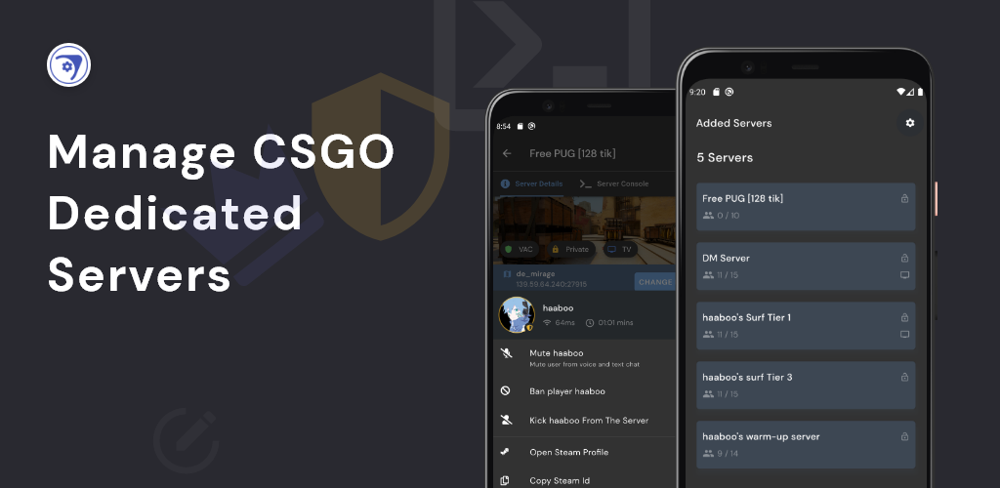

  

<h1 align="center">Source Server Manager</h1>

  

<!-- Add Badges here -->

## Features

- ✨ Modern UI.
- 🔐 Manage unlimited servers with RCON.
- ⚙️ Manage server maps and almost anything from real time console.
- 🌍 Supports 3 languages (English, Hindi and Arabic).
- 🤠 View players on server with their roles.
- 🔨 Kick, mute or Ban players with one click.

    
    
    

## Contributing

We welcome all contributions.

- You can submit any ideas as Pull Request or Issues.
- If you'd like to improve code, make sure you stick to exisiting practices in code.

## Support And Feedback

Join support `#csgo-server-manager` channel on Discord

## Credits

Made with <a href="https://github.com/Hexer10/source_server" title="Flaticon"> source_server</a> by <a href="https://github.com/Hexer10" title="Freepik">Hexer10</a>

## License

Copyright (c) Mohit Kumar Yadav. All rights reserved.

